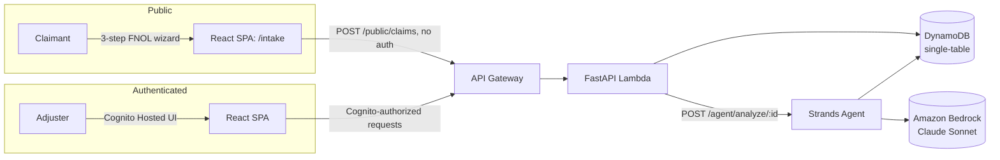
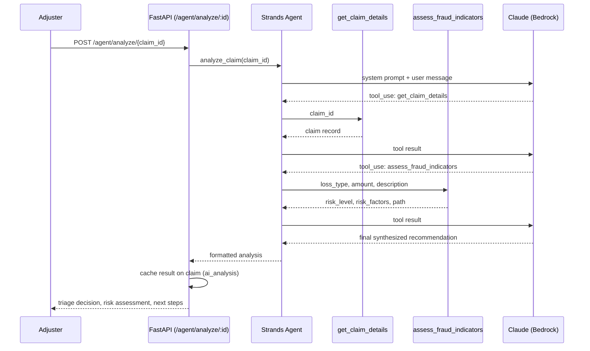

# Claim Flow

**An AWS-native P&C claims workflow orchestrator with an agentic AI assistant for claim triage.**

Claimants report a loss through a public First Notice of Loss (FNOL) wizard. Claims are auto-triaged on submission, then an adjuster can request an AI-generated analysis — built on a real agent, not a single prompt — that pulls the claim record, runs a rules-based fraud check, and synthesizes a recommendation.

This project exists to demonstrate a production-shaped agentic AI system on AWS: real auth, real data modeling, real infrastructure-as-code, and an agent whose tool-calling behavior is explainable end to end.

---

## Overview

- **Adjusters** log in (Cognito, invite-only) to a dashboard showing the claims queue, and can drill into any claim for detail, status management, and AI-assisted analysis.
- **Claimants** submit a loss report through a fully public, unauthenticated 3-step intake wizard — no account required.
- Every submitted claim is **auto-triaged** by server-side rules into one of three handling paths.
- Adjusters can trigger a **Strands agent** (Bedrock-hosted Claude) to produce a structured recommendation: triage decision, risk assessment, next steps, and missing information.

## Architecture

| Layer | Technology |
|---|---|
| Frontend | React + TypeScript + Vite SPA |
| Auth | Amazon Cognito (invite-only, hosted UI, role groups) |
| API | FastAPI on AWS Lambda (via Mangum), behind API Gateway |
| Data | DynamoDB, single-table design |
| Agentic AI | [Strands Agents SDK](https://strandsagents.com/) + Amazon Bedrock (Claude Sonnet) |
| Infrastructure | AWS SAM (CloudFormation) |
| Hosting | CloudFront + S3 (frontend) |



## Agentic Claim Analysis

The centerpiece of this project is a small but real agent — not a single LLM call dressed up as "AI."

`backend/services/claims_agent_service.py` defines a [Strands](https://strandsagents.com/) `Agent` backed by `BedrockModel` (Claude Sonnet on Amazon Bedrock), with two tools:

- **`get_claim_details`** — reads the full claim record from DynamoDB.
- **`assess_fraud_indicators`** — a deterministic, rules-based check (claim amount thresholds, loss-type risk, red-flag language in the claimant's description). This is plain Python, not the model — the agent orchestrates it, it doesn't reason it out.



**Worth understanding, not just showing:** the call order above (details, then fraud check, then synthesis) isn't enforced by any code. It's driven entirely by the agent's system prompt, which gives the model plain-English step-by-step instructions. The model's own reasoning over those instructions produces the sequence — this is "prompt-as-control-flow," and it's a deliberate, honest characteristic of this design, not a gap. It's also why the system prompt is treated as a first-class, carefully-written artifact rather than an afterthought.

Results are cached onto the claim record in DynamoDB (`ai_analysis`, `ai_analysis_at`) so re-viewing a claim doesn't re-run the agent; adjusters can force a fresh run with `?force=true`.

## Auto-Triage Logic

Applied automatically at intake, before any AI involvement (`backend/api/claim_api.py`):

| Condition | Triage Result |
|---|---|
| `loss_type == "liability"` | SIU (Special Investigations Unit) |
| `estimated_amount > $50,000` | SIU |
| `loss_type == "auto"` | Straight-through processing |
| everything else | Manual review |

## Environments

Three environments — local dev, QA, and prod — deployed as separate AWS SAM stacks, each with its own Cognito pool, DynamoDB table, and API Gateway stage. See `CLAUDE.md` for deploy commands and full environment configuration.

## Getting Started

```
# Frontend
cd frontend && npm install && npm run dev

# Backend
cd backend
python -m venv .venv && .venv\Scripts\Activate.ps1
pip install -r requirements.txt
uvicorn app:app --reload

# Infrastructure
cd infrastructure
sam build
sam deploy --guided --config-env qa
```

Full command reference, environment variables, and architecture conventions are in [`CLAUDE.md`](CLAUDE.md).

## Screenshots

_TODO: dashboard, intake wizard, agent analysis output_

## Roadmap

- **Amazon Bedrock AgentCore** — not used today. The agent runs inline, synchronously, inside the API Lambda, which is appropriate for this demo's scale. AgentCore (managed runtime, session memory, identity, observability) would be the natural next step for productionizing multi-tenant or higher-scale agent workloads.
